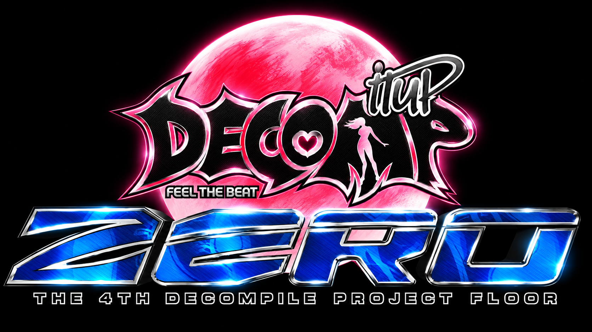

# ZeroReconstructed

A faithful C reconstruction of **Pump It Up: Zero** (International 7th Dance Floor), based on the
Linux arcade executable `piu` (ELF i386).

This project reverse-engineers the original binary and reproduces its gameplay, rendering, audio,
and state machine as closely as possible — no emulation, no wrappers. Native executable for
Windows and Linux, built with SDL2 + OpenGL.

It continues the series **PumpyReconstructed** (PREX 3) → **ExceedReconstructed** →
**Exceed2Reconstructed**. Screens from earlier versions that were replaced by their Zero
counterparts are kept in the tree, disabled (commented out or left out of the build).

## Status

| Feature                                                          | Status |
| ---------------------------------------------------------------- | ------ |
| Asset decryption: ENC1/ENC2 (`.AUD` / `.PNZ`), RESPAC2 (`.DAT`), MOV3 (`.MOV`) | ✅ |
| Boot straight to LOGO (`BGA\81.DAT`, no R_WARN)                  | ✅      |
| Title: `BGA\CREDIT.MOV` background + `WAVE\TITLE.WAV`            | ✅      |
| Station Select (CStation): EASY / ARCADE / MISSION / REMIX, voices | ✅    |
| Song select (CSelect): disc wheel, video preview, 60 s counter   | ✅      |
| Song select: channels, 1P/2P difficulties, modifier codes, sounds | ✅     |
| Song table: 148 songs from `piu` (+ C44 as an extra)             | ✅      |
| Initial unlock state (locked songs / Another charts)             | ✅      |
| Gameplay: note skins from `BGA\SKINxx.DAT` (8 skins)             | ✅      |
| Gameplay: row-based judgment (taps, long notes, long + tap)      | ✅      |
| Gameplay: judgment / combo from `BGA\COMBO.DAT`                  | ✅      |
| Gameplay: step effect (`arrowp`), explosion (`arrowf`), sparks   | ✅      |
| Song backgrounds: `BGA\%X.DAT` → `BGA\%X.MOV` → `BGA\000.MOV`    | ✅      |
| Dance Grade: `GRADE.MOV`, `SCOREFONT`, letters from `GRADE.DAT`  | ✅      |
| Stage Break (`STAGEBREAK.MOV` / `.WAV`)                          | ✅      |
| EASY Station (CSelectEz) / MISSION Station (CSelectMission)      | ❌ (falls back to ARCADE) |
| Next Stage / Game Over / Continue / Reward in Zero style         | ⚙️ Still the Exceed 2 versions |
| Skin selection through select codes (needs `PIUZERO.INI` unlocks) | ⚙️ Use `/skin N` in the console |
| Modifiers in gameplay other than 2X/3X/4X/8X and RV              | ⚙️ Shown on select, not applied yet |

## Song Select Controls

| Pad | Action |
| --- | ------ |
| DL / DR | Previous / next song (held: 300 → 200 → 100 → 50 ms repeat) |
| UL | Next available difficulty |
| UR | Next channel: BANYA → K-POP → POP → (ANOTHER, when open) → BANYA. REMIX is fixed when chosen in the Station |
| C | First press: READY. Second press: start |

## Modifiers (Commands)

Entered on the song select screen with the pads of the player they apply to (tables
`0x0811c3a0` / `0x0811c960` in `piu`).

| Sequence | Effect |
| -------- | ------ |
| `UL UR UL UR C` | Speed: 2X → 3X → 4X → 8X → RV → off |
| `UL UR UL UR UL UR UL UR C` | RV (random velocity) |
| `UL UR DL DR C` | Vanish → Non-Step → off |
| `UL UR UL UR DL DR DL DR C` | RS (random step) |
| `DL UR DL UR DR UL DR UL C` | X (global, both players) |
| `DR DL UR UL DR UR DL UL C` | EW (earthworm) |
| `UL DL UR DR DR UL UR DL C` | FD (freedom) |
| `DL DL DR DR UL UL UR UR C` | AC (acceleration) |
| `DR DR DL DL UR UR UL UL C` | DC (deceleration) |
| `DR DL UR UL DR DL UR UL C` | MR (mirror) |
| `DL UR C DL DR UL C DR C` | 1P × 2P (2 players) |
| `DL DR DL DR DL DR` | Reset |

Skin codes (`UL UR DL C DL DR DR UR x`) and grade reverse require unlocks stored in
`PIUZERO.INI`, which are not implemented yet.

## Debug Console Extras

| Command | Effect |
| ------- | ------ |
| `/skin N` | Use `BGA\SKIN0N.DAT` (0..7) from the next song on |
| F8 (during a song) | Autoplay on/off |

## Project Structure

```
ZeroReconstructed/
├── src/
│   ├── main.c            # Entry point, state machine, game loop
│   ├── intro.c / logo.c  # Attract and title
│   ├── zero_station.c    # Station Select (CStation)
│   ├── zero_select.c     # Song select (CSelect)
│   ├── zero_songs.c      # Song table generated from piu (tools/gen_zero_songs.py)
│   ├── zero_dog.c        # MicroDog "Convert" answers used by the asset ciphers
│   ├── gameplay.c        # Input, row judgment, long notes, skins, rendering
│   ├── result.c          # Dance Grade and stage progression
│   ├── movie.c           # MOV2/MOV3 playback (libmpeg2)
│   ├── resource.c        # SPR/BGA/DAT/RESPACK/RESPAC2/ENC1/ENC2 loading
│   ├── bga.c             # BGA playback, BGA3 scenes
│   ├── exceed_select.c   # Exceed 2 select (disabled) + shared helpers
│   └── ...               # audio, input, render, texture, console, etc.
├── include/              # Headers (pumpy.h = main game state)
├── tools/
│   ├── zero_decrypt.py   # Extracts .AUD / .PNZ / .DAT / .MOV from the Zero data
│   ├── gen_zero_songs.py # Song table generator (reads piu)
│   ├── gen_zero_dog.py   # Generates src/zero_dog.c from tools/data/zero_dog.key
│   └── lua50_dump.py     # Lua 5.0 bytecode dumper for SCRIPT\*.LUA
└── CMakeLists.txt
```

## Building (Windows and Linux)

Window, input and audio use **SDL2**, rendering is **OpenGL 1.1 + GLU**, and video uses
**libmpeg2** (the game's own `MPEG2.dll` is 32-bit and cannot be loaded by an x64 build).

**Windows** (Visual Studio 2019+ with [vcpkg](https://vcpkg.io))

```powershell
vcpkg install sdl2:x64-windows zlib:x64-windows libmpeg2:x64-windows
cmake -S . -B build -A x64 -DCMAKE_TOOLCHAIN_FILE=<vcpkg>/scripts/buildsystems/vcpkg.cmake
cmake --build build --target Pumpy --config Release
```

**Linux**

```bash
sudo apt install cmake build-essential libsdl2-dev libgl-dev libglu1-mesa-dev zlib1g-dev libmpeg2-4-dev
cmake -S . -B build -DCMAKE_BUILD_TYPE=Release
cmake --build build --parallel
```

The CMake target is still named `Pumpy`. Place the executable in the Zero data folder,
next to `AUDIO/`, `BGA/`, `SCRIPT/`, `TITLE/`, `WAVE/` and `STEP.DAT`. Assets are **not**
included — you must provide your own copy of the Pump It Up Zero data files.

## Technical Notes

### Asset ciphers

- **ENC2** (`.AUD` = MP3, `.PNZ` = PNG): same scheme as Exceed 2, but the 4-byte seed of the key
  function (`0x80a3dc0`) is the MicroDog 3.4 "Convert" answer for the file's own 16-byte key
  (`0x80a6058`), so it changes per file. Answers come from the dongle table embedded in
  pumptools' `zerohook` (`tools/data/zero_dog.key`).
- **ENC1** (`D*.AUD` previews): 0x86-byte header, size = `u32@0x7E ^ 0xCCBB`, static 1 KB table
  at `0x8103940`, verified with Adler-32.
- **RESPAC2** (`.DAT`): index always at 0x28; global key also goes through the dongle.
- **MOV3** (`.MOV`): extra 16-byte key before the padding; MPEG-2 stream at `0xD0 + N`.

### Gameplay layout (SKIN00)

- Notes are `skinN.spr` (64×64, `TYPE ani`), positioned by code: column × 50 from x = 28 (P1)
  / 348 (P2), per-skin column offsets (`0x80806f0`). Step zone `01.spr` drawn at (32, 42).
- Long notes (`0x8087520`): body `skinN_l2` stretched as one quad, end `skinN_l3`, head
  `skinN_l1` on top; a held long note starts from the middle of the step zone.
- Judgment is per row (`0x808a760`): holding the pad hits long-note parts inside the PERFECT
  window; a row is judged once all its notes are hit; one MISS per row.

### Scoring and grade

- PERFECT +1000, GREAT +500 (each +1000 more with combo ≥ 4), GOOD +100, BAD −700, MISS −1000
- Grade: S ≥ 1.0 with no MISS, A ≥ 0.95, B ≥ 0.90, C ≥ 0.85, D ≥ 0.75, else F

## License

This project is for educational and research purposes only. It is not affiliated with or
endorsed by Andamiro Co., Ltd. All original game assets remain the property of their
respective owners.
